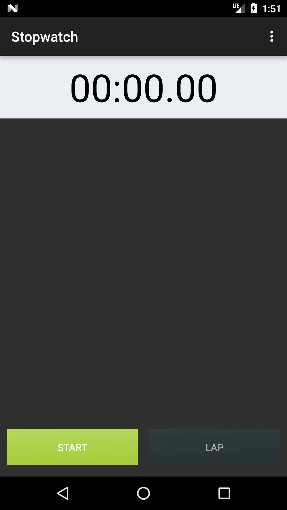
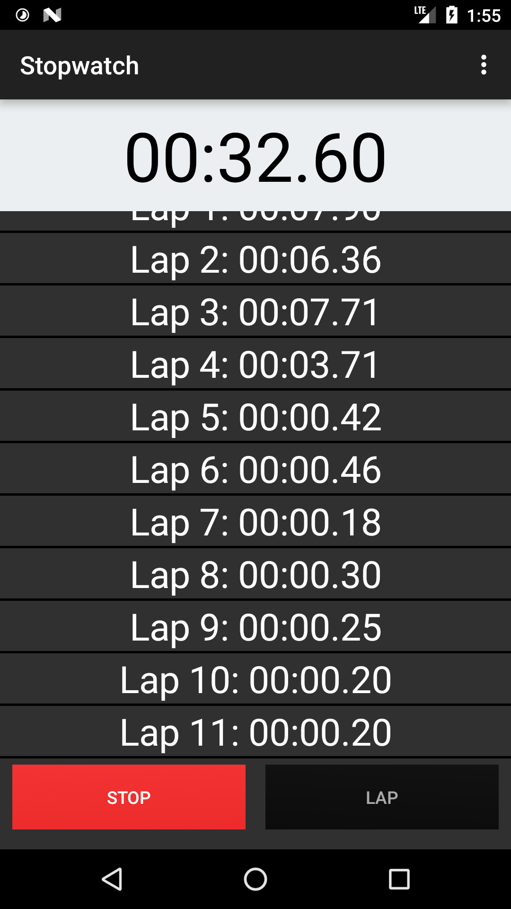
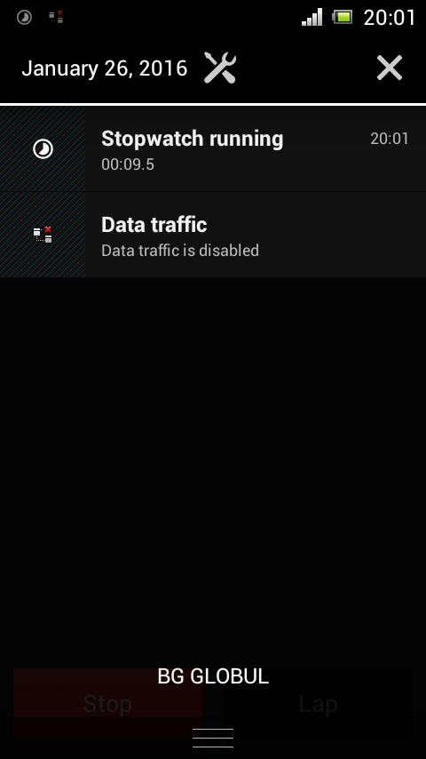
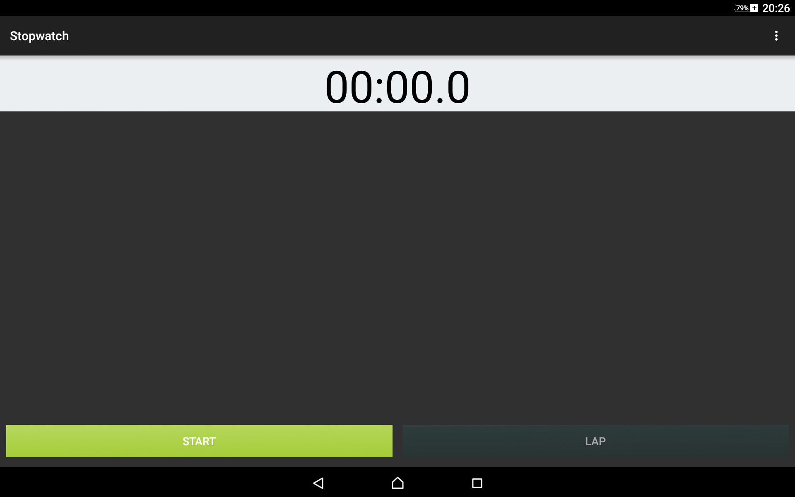
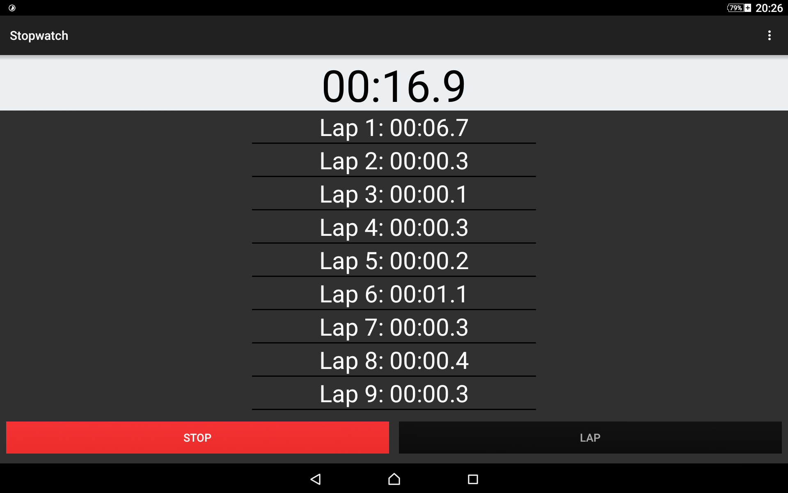

android-stopwatch
=================

Stopwatch application for android. 

It uses a thread so the TextView can update every 10 hundredths of a secound.
#Download
[Stopwatch-1.0](https://github.com/dimchoSCR/android-stopwatch/releases/download/v1.0/Stopwatch-1.0.apk)

[Stopwatch-1.5](https://github.com/dimchoSCR/android-stopwatch/releases/download/v1.5/Stopwatch-1.5.apk)

[Stopwatch-1.6](https://github.com/dimchoSCR/android-stopwatch/releases/download/v1.6/Stopwatch-1.6.apk)
